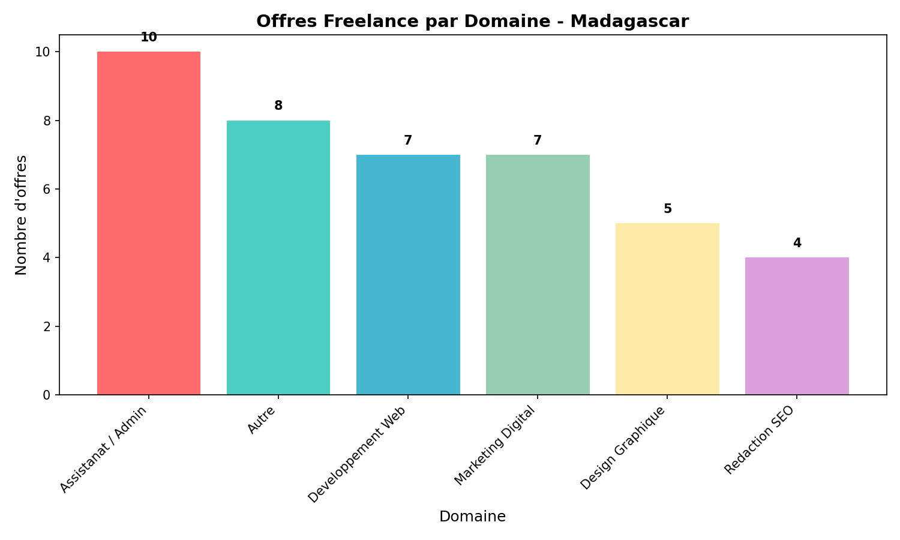

# Projet Analyse Freelance Madagascar

## Objectif
Analyser le marché freelance malgache à partir des offres publiées.

## Source des données
- MadaAllStar.org (avril 2026)
- 41 offres d'emploi freelance collectées

## Résultats

### Domaines qui recrutent le plus
- Assistanat / Admin: 10 offres (24%)
- Autre: 8 offres (20%)
- Développement Web: 7 offres (17%)
- Marketing Digital: 7 offres (17%)
- Design Graphique: 5 offres (12%)
- Rédaction SEO: 4 offres (10%)

### Compétences les plus demandées
- Assistant: 14 offres
- SEO: 4 offres
- Community: 4 offres
- WordPress: 3 offres
- Graphiste: 3 offres

### Graphique


### Tarifs
Les 41 offres ne précisent pas les tarifs. Sur MadaAllStar, les recruteurs ne publient pas les prix.

## Fichiers
- `offres_freelance_mada.csv` - Données brutes
- `projet_final.py` - Script d'analyse
- `resultat_final.png` - Graphique

## Exécution du projet
```bash
pip install requests beautifulsoup4 pandas matplotlib
python projet_final.py